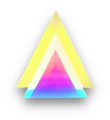

# Gyre

A server for AI image generation. Provides a backend service over multiple APIs
(GRPC and REST) for use by one or more frontends.

In particular, aims to be a local, open source implementation of the Stability AI APIs,
but also includes a lot of useful extensions.

# Features

## Standard Stable Diffusion features

- Create an image from just a text prompt (txt2img)
- Create an image from an existing image and a text prompt (img2img)
- Fill in a hole in an image, or extend an image (inpainting)

## Enhancements

- Enhanced inpainting and outpainting, including Grafted Inpainting
  - When used with the standard Stable Diffusion V1.5 model, results are more consistent to the existing image
  - When used with a model such as Waifu Diffusion that does not have an inpaint model, can either "graft"
    the model on top of the Stable Diffusion inpainting or work in an exclusive model-independant model
- Custom CLIP guidance allows using newer CLIP models to more accurately follow prompts
  - Faster and better results than the standard Diffusers version
- Negative prompting and weighting of parts of a promt (send multiple `Prompt` objects with `text` and any positive or negative `weight`)
- All K_Diffusion schedulers available, and working correctly (including DPM2, DPM2 Ancestral and Heun
- Can load multiple pipelines, such as Stable and Waifu Diffusion, and swap between them as needed
- Adjustable NSFW behaviour
- Potentially lower memory requirements using a variety of model offloading techniques
- Cancel over API (using GRPC cancel will abort the currently in progress generation)
- Various performance optimisations
  + XFormers support, if installed
  + ToMe support, if nonfree code included (recommend XFormers instead where available, but ToMe doesn't have complicated dependancies)
  
# Installation

## Colab (coming soon)

## Docker (easiest if you already have Docker, and an Nvidia GPU with 4GB+ VRAM)

```
docker run --gpus all -it -p 50051:50051 \
  -e HF_API_TOKEN={your huggingface token} \
  -e SD_LISTEN_TO_ALL=1 \
  -v $HOME/.cache/huggingface:/huggingface \
  -v `pwd`/weights:/weights \
  hafriedlander/gyre:xformers-latest
```

#### Localtunnel

The docker image has built-in support for localtunnel, which
will expose the GRPC-WEB endpoint on an https domain. It will
automatically set an access token key if you don't provide one.
Check your Docker log for the values to use

```
  -e SD_LOCALTUNNEL=1 \
```

#### Volume mounts

This will share the weights and huggingface cache, but you can
mount other folders into the volume to do other things:

- You can check out the latest version of the server code and then
mount it into the Docker image to run the very latest code (including
any local edits you make)

  ```
    -v `pwd`/gyre:/gyre \
  ```

- Or override the engines.yaml config by making a config directory,
putting the engines.yaml in there, and mounting it to the image

  ```
   -v `pwd`/config:/config \
  ```

All the server arguments can be provided as environment variables, starting
with SD:

- SD_ENGINECFG
- SD_GRPC_PORT
- SD_HTTP_PORT
- SD_VRAM_OPTIMISATION_LEVEL
- SD_NSFW_BEHAVIOUR
- SD_WEIGHT_ROOT
- SD_HTTP_FILE_ROOT
- SD_ACCESS_TOKEN
- SD_LISTEN_TO_ALL
- SD_ENABLE_MPS
- SD_RELOAD
- SD_LOCALTUNNEL

#### Building the image locally

```
docker build --target main .
```

Or to build (slowly) with xformers

```
docker build --target xformers .
```

## Locally (if you have an Nvidia GPU with 4GB+ VRAM, and prefer not to use Docker)

### Option 1 (recommended):

Install Miniconda, then in a Conda console:

```
git clone https://github.com/hafriedlander/gyre.git
cd gyre
conda env create -f environment.yaml
conda activate sd-grpc-server
```

Then for Windows:

```
set PIP_EXTRA_INDEX_URL=https://download.pytorch.org/whl/cu116 
flit install --pth-file
set HF_API_TOKEN={your huggingface token}
python ./server.py
```

Or for Linux

```
PIP_EXTRA_INDEX_URL=https://download.pytorch.org/whl/cu116 flit install --pth-file
HF_API_TOKEN={your huggingface token} python ./server.py
```

### Option 2:

Create a directory and download https://raw.githubusercontent.com/hafriedlander/gyre/main/engines.yaml into it, then

```
set PIP_EXTRA_INDEX_URL=https://download.pytorch.org/whl/cu116 
pip install gyre
set HF_API_TOKEN={your huggingface token} 
gyre
```


# Thanks to / Credits:

- Seamless outpainting https://github.com/parlance-zz/g-diffuser-bot/tree/g-diffuser-bot-beta2
- Additional schedulers https://github.com/hlky/diffusers
- K-Diffusion integration example https://github.com/Birch-san/diffusers/blob/1472b70194ae6d7e51646c0d6787815a5bc65f75/examples/community/play.py

# Roadmap

Core API functions not working yet:

- ChainGenerate not implemented

Extra features to add

- Progress reporting over the API is included but not exposed yet
- Embedding params in png
- Extra APIs
  - Image resizing
  - Aspect ratio shifting
  - Asset management
  - Extension negotiation so we can:
    - Ping back progress notices
    - Allow cancellation requests
    - Specify negative prompts
- Community features: 
  - Prompt calculation https://github.com/pharmapsychotic/clip-interrogator/blob/main/clip_interrogator.ipynb
  - Prompt suggestion https://huggingface.co/spaces/Gustavosta/MagicPrompt-Stable-Diffusion
  - Prompt compositing https://github.com/energy-based-model/Compositional-Visual-Generation-with-Composable-Diffusion-Models-PyTorch
  - Automasking https://github.com/ThstereforeGames/txt2mask
  - Huge seeds


# License

The main codebase is distributed under Apache-2.0. Dependancies are all compatible with that license, except as noted here:

- The nonfree directory contains code under some license that is more restrictive than Apache-2.0. Check the individual
  projects for license details. To fully comply with the Apache-2.0 license, remove this folder before release.
  + ToMe
  + Codeformer
- The Docker images contain a bunch of software under various open source licenses. The docker images tagged 'noncomm'
  include the nonfree folder, and so cannot be used commercially.

[](https://www.stablecabal.org/)
